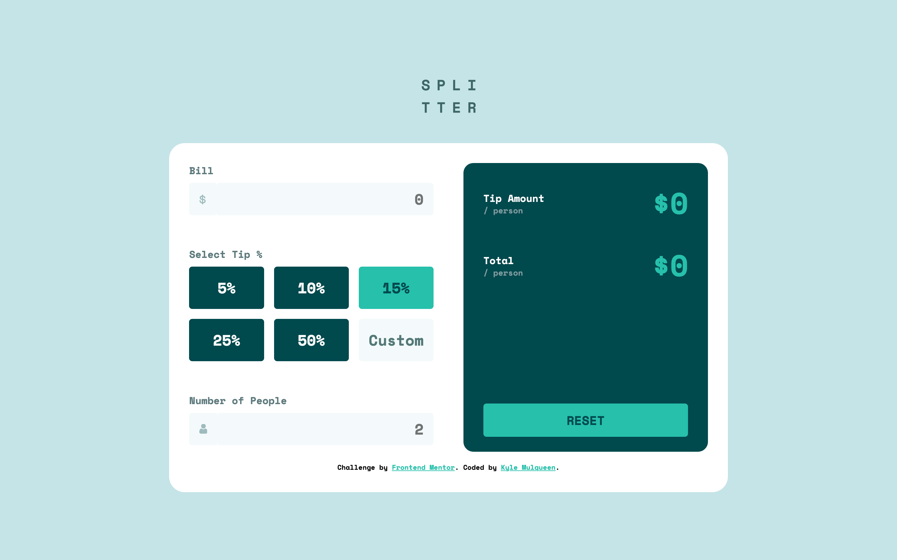
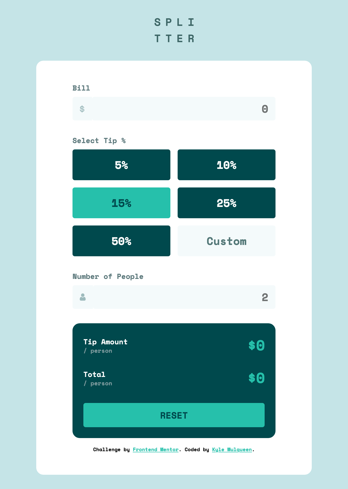
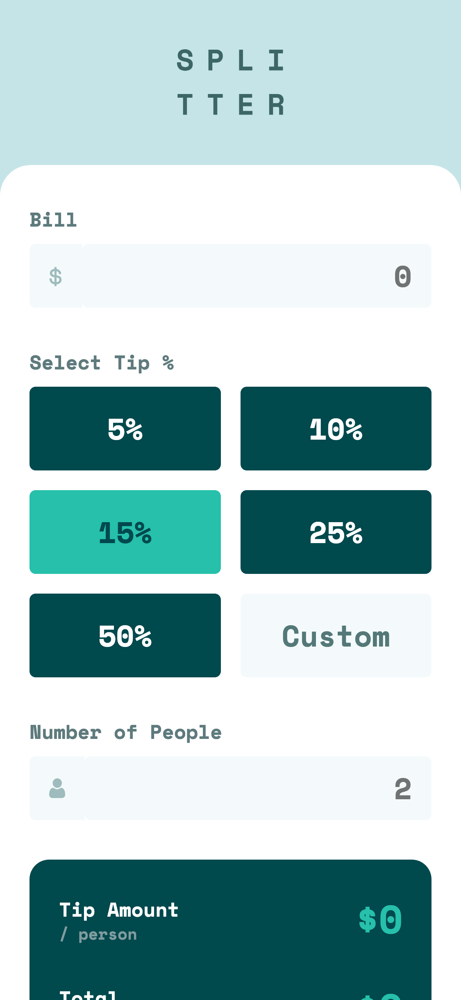

# Frontend Mentor - Tip calculator app solution

This is a solution to the [Tip calculator app challenge on Frontend Mentor](https://www.frontendmentor.io/challenges/tip-calculator-app-ugJNGbJUX). Frontend Mentor challenges help you improve your coding skills by building realistic projects.

## Table of contents

- [Frontend Mentor - Tip calculator app solution](#frontend-mentor---tip-calculator-app-solution)
  - [Table of contents](#table-of-contents)
  - [Overview](#overview)
    - [The challenge](#the-challenge)
    - [Screenshot](#screenshot)
    - [Links](#links)
  - [My process](#my-process)
    - [Built with](#built-with)
    - [What I learned](#what-i-learned)
    - [Continued development](#continued-development)
    - [Useful resources](#useful-resources)
  - [Author](#author)

## Overview

### The challenge

Users should be able to:

- View the optimal layout for the app depending on their device's screen size
- See hover states for all interactive elements on the page
- Calculate the correct tip and total cost of the bill per person

### Screenshot

**Desktop solution**

**Tablet solution**

**Mobile solution**

### Links

- Solution URL: [GitHub Pages](https://kmulqueen.github.io/tip-calculator/)

## My process

### Built with

- Semantic HTML5 markup
- CSS custom properties
- Flexbox
- CSS Grid
- Mobile-first workflow
- JavaScript

### What I learned

Working on this tip calculator project helped me deepen my knowledge in several key areas:

- **Semantic HTML**: I learned how to structure HTML for better accessibility, including proper use of landmarks like `role="region"` with descriptive `aria-label` attributes.
- **Accessibility best practices**: I implemented proper focus management with `aria-live` regions for dynamic content and included hidden elements for screen readers.
- **BEM methodology**: I gained practical experience with the Block-Element-Modifier naming convention, creating more maintainable CSS.
- **CSS selectors**: Learned about powerful selectors like `:focus-within` and `:has()` to create better UX for form elements.
- **Form styling**: Discovered techniques for styling number inputs, handling focus states that span multiple elements, and creating custom error states.
- **JavaScript event handling**: Implemented robust event listeners for form inputs with proper error handling and validation patterns.
- **State management**: Developed a clear approach to managing application state with scoped variables and consistent update functions.
- **Browser quirks**: Learned about browser-specific behaviors with form persistence across page reloads and how to handle them explicitly.

### Continued development

In future projects, I want to focus on:

- **Advanced CSS techniques**: Refining my skills with CSS Grid for complex layouts and responsive designs.
- **JavaScript form validation**: Building more sophisticated custom validation systems rather than relying on HTML5 validation alone.
- **CSS architecture**: Improving my understanding of when to use utility classes vs. strict BEM methodology for optimal maintainability.
- **Accessibility testing**: Learning to use screen readers and other tools to verify my implementations work as intended for all users.
- **Responsive design patterns**: Developing more fluid layouts that work across all device sizes without breakpoints.
- **Modern JavaScript features**: Exploring ES6+ features like destructuring, template literals, and array methods to write more concise code.
- **Unit testing**: Implementing test suites for calculator logic to ensure calculations remain accurate through refactoring.
- **Code documentation**: Further refining JSDoc commenting for better code maintenance and potential documentation generation.

### Useful resources

- [MDN Web Docs on ARIA](https://developer.mozilla.org/en-US/docs/Web/Accessibility/ARIA) - Comprehensive guide on implementing proper accessibility attributes that helped me understand how to structure regions and live areas.
- [CSS-Tricks Guide to Flexbox](https://css-tricks.com/snippets/css/a-guide-to-flexbox/) - Clear visual explanations that helped with structuring the form layout.
- [A11y Project Checklist](https://www.a11yproject.com/checklist/) - Practical accessibility checklist that guided my implementation of inclusive features.
- [BEM Naming Convention](https://getbem.com/naming/) - Official documentation that clarified how to properly structure CSS class names.
- [JavaScript Event Reference](https://developer.mozilla.org/en-US/docs/Web/Events) - Helped me choose the right events for different input scenarios.
- [Form Validation UX Patterns](https://www.smashingmagazine.com/2022/09/inline-validation-web-forms-ux/) - Guided my approach to error handling and validation timing.

## Author

- Website - [Kyle Mulqueen](https://kmulqueen.github.io/portfolio-2025/)
- Frontend Mentor - [@kmulqueen](https://www.frontendmentor.io/profile/kmulqueen)
